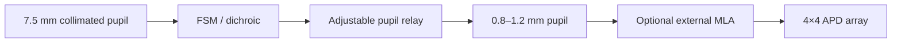
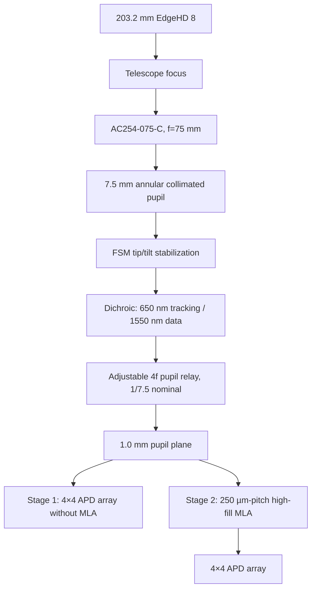

# FSO OGS APD Array Receiver PoC 설계 정리

작성일: 2026-09-17
목표: 지상-위성 FSO 링크에서 대기 난류, scintillation, beam wander 및 잔류 pointing error를 완화하기 위한 4×4 고속 APD array 수신부 PoC 사양 정리

---

## 1. 핵심 결론

현재 OGS 수신부는 다음과 같이 해석하는 것이 가장 정확하다.

주요 설계 결론은 다음과 같다.

1. EdgeHD 8의 31% 중앙 차폐는 **직경비**이며, 면적 차폐율은 약 9.8%, 순수 수광 손실은 약 0.45 dB이다.
2. 203.2 mm Telescope 구경이 25.4 mm collimator 면에 그대로 결상되는 것이 아니다. AC254-075-C가 f/10 수렴광을 받아 약 7.5 mm 직경의 평행광으로 변환한다.
3. 현재 AC254-060-C는 약 7.5 mm 빔을 50 µm MMF에 집속하기 위한 렌즈이다. APD array를 pupil plane에서 사용할 경우 이 렌즈는 제거하고, **pupil relay**로 대체해야 한다.
4. 기존 7.5 mm 빔에 GBE10-C를 역방향 적용하면 약 0.75 mm, GBE20-C를 적용하면 약 0.375 mm가 된다. 250 µm pitch의 4×4 array에는 약 1.0 mm pupil이 적절하므로, GBE20-C는 부적합하고 GBE10-C도 정확히 맞지 않는다.
5. 권장 구조는 `7.5 mm → 약 1.0 mm`의 가변 4f/Keplerian pupil relay이다. 명목 축소비는 약 1/7.5이다.
6. APD array는 `4×4`, `250 µm pitch`, `APD20D1급 28-Gbaud APD`, `100 µm backside integrated lens`를 기준으로 한다.
7. 외부 microlens array 없이 1차 PoC를 수행할 수 있지만, 250 µm pitch에 100 µm lens만 사용하면 기하학적 fill-factor 손실이 약 9 dB이므로 최종 링크에서는 고-fill-factor MLA 또는 더 큰 integrated lens가 필요하다.

---

## 2. 현재 OGS 수신부 광학계

참조 구성도: `d03b1950-31d3-4923-be17-ff2d1ce74dbe.png`

### 2.1 현재 구성 요소

| 위치 | 구성 요소 | 현재 역할 |
|---|---|---|
| 수신 개구 | Celestron EdgeHD 8 | 203.2 mm 구경으로 위성 신호 수집 |
| Telescope 초점 | EdgeHD 8, f = 2032 mm, f/10 | 평행 입사광을 초점면에 집속 |
| Collimator | AC254-075-C, f = 75 mm | Telescope의 f/10 수렴광을 약 7.5 mm 평행광으로 변환 |
| Beam stabilization | FSM3000 | global tip/tilt 및 잔류 pointing error 보정 |
| Wavelength separation | Dichroic beamsplitter | 650 nm beacon/tracking 경로와 1550 nm data 경로 분리 |
| 기존 data coupling | AC254-060-C, f = 60 mm | 1550 nm 빔을 50 µm MMF core에 집속 |
| 기존 MMF | HFB003 holder, OM3/OM4 50 µm core | 수신광을 fiber receiver로 전달 |
| Tracking branch | beamsplitter, BPF, AC254-150-A, camera | 650 nm beacon 영상 및 tracking error 측정 |

### 2.2 Telescope와 collimator 사이의 실제 배율

EdgeHD 8은 f/10 Telescope이다. 따라서 초점 부근에서 광선 원뿔의 f-number는 약 10이며, 초점으로부터 75 mm 떨어진 위치에서 빔 직경은 대략 다음과 같다.

\[
D_{\mathrm{coll}} \simeq \frac{f_{\mathrm{coll}}}{F\#}
=\frac{75\ \mathrm{mm}}{10}=7.5\ \mathrm{mm}
\]

동일한 결과를 Telescope와 collimator의 초점거리 비로도 구할 수 있다.

\[
D_{\mathrm{coll}}
=D_{\mathrm{tel}}\frac{f_{\mathrm{coll}}}{f_{\mathrm{tel}}}
=203.2\frac{75}{2032}
\simeq7.5\ \mathrm{mm}
\]

따라서 다음과 같이 구분해야 한다.

- 25.4 mm는 AC254-075-C의 물리적인 clear aperture에 가까운 값이다.
- 실제 collimated beam은 약 7.5 mm이다.
- 203.2 mm Telescope aperture가 25.4 mm 렌즈 전체에 상으로 맺히는 구조가 아니다.
- Entrance pupil의 공간 정보는 광선 각도로 변환되었다가 collimator 뒤에서 축소된 pupil 형태로 재구성된다.
- 구경 직경의 실질적 축소비는 약 `203.2/7.5 = 27.1`, 즉 약 1/27이다.

### 2.3 현재 MMF coupling의 집속 조건

AC254-060-C에 들어가는 빔을 7.5 mm로 보면 유효 f-number는 다음과 같다.

\[
F\# \simeq \frac{60}{7.5}=8
\]

1550 nm에서 Airy disk의 첫 번째 영점 기준 직경은

\[
d_{\mathrm{Airy}}\simeq2.44\lambda F\#
=2.44\times1.55\ \mu\mathrm{m}\times8
\simeq30.3\ \mu\mathrm{m}
\]

정의에 따라 Airy diameter를 다르게 표현하면 약 30–38 µm 범위가 되며, 이는 현재 50 µm MMF core와 대체로 부합한다.

즉, AC254-060-C는 **beam reducer가 아니라 focal-plane coupling lens**이다.

---

## 3. MMF coupling을 APD array로 대체할 때의 핵심 변경

### 3.1 Focal-plane array와 pupil-plane array의 차이

| 배치 | 주로 보상하는 현상 | 특성 |
|---|---|---|
| Telescope 초점면의 조밀한 PD array | beam wander, spot displacement, residual tracking error | Weng 논문의 2-D PDA와 유사 |
| Pupil-conjugate plane의 subaperture APD array | 공간적으로 다른 난류 fading 및 scintillation | Martinez의 multi-aperture 개념과 더 가까움 |

본 연구의 주목표가 지상-위성 대기 난류 완화이므로, APD array는 단순한 focal spot detector가 아니라 **축소된 Telescope pupil을 sampling하는 pupil-plane receiver**로 구성하는 것을 권장한다.

이에 따라 1550 nm data branch는 다음과 같이 변경한다.

### 3.2 AC254-060-C 유지 여부

AC254-060-C를 그대로 유지하면 빔은 약 30–38 µm 초점으로 모인다. 이는 다음 목적에는 적합하다.

- 단일 APD 또는 MMF coupling
- Weng 방식의 focal-plane beam-position diversity
- 작은 PD array 위에 30–150 µm 크기의 spot을 의도적으로 defocus하는 실험

반면 다음 목적에는 적합하지 않다.

- 203.2 mm Telescope pupil을 4×4 subaperture로 나누어 sampling
- 각 APD가 Telescope pupil의 서로 다른 공간 영역을 관측
- Martinez 방식의 spatial-diversity 구조를 direct-detection APD로 구현

따라서 최종 PoC에서는 AC254-060-C와 MMF를 제거하고 pupil relay를 배치하는 것이 기본안이다. AC254-060-C는 비교 실험용 focal-plane receiver에만 남겨 두는 것이 좋다.

---

## 4. Beam reducer 및 pupil relay 사양

### 4.1 GBE10-C와 GBE20-C 사용 시

현재 7.5 mm collimated beam을 기준으로 하면 다음과 같다.

| 부품 | 역방향 축소 후 빔 직경 | 평가 |
|---|---:|---|
| GBE10-C | 약 0.75 mm | 4×4, 250 µm pitch array를 다소 underfill |
| GBE20-C | 약 0.375 mm | 중앙 일부 채널에만 광이 들어갈 가능성이 높아 부적합 |
| 권장 pupil relay | 약 1.00 mm | 4×4, 250 µm pitch와 정합 |

GBE는 collimated beam의 직경을 바꾸는 데는 사용할 수 있지만, Telescope pupil을 원하는 검출면에 정확히 결상하고 telecentricity를 제어하기에는 custom 4f relay가 더 적합하다.

### 4.2 권장 relay

| 항목 | 권장값 |
|---|---|
| 입력 pupil | 약 7.5 mm |
| 명목 출력 pupil | 약 1.0 mm |
| 축소비 | 약 1/7.5 |
| 조정 범위 | 0.8–1.2 mm |
| 형식 | Keplerian 또는 telecentric 4f pupil relay |
| 파장 | 1550 nm 중심, 1530–1570 nm |
| 최종면 | APD/MLA plane과 pupil-conjugate |
| 필수 확인 | clipping, aberration, chief-ray angle, pupil distortion |

GBE10-C를 반드시 사용해야 한다면 collimator 초점거리를 100 mm 정도로 바꾸어 약 10 mm collimated beam을 만든 후 1/10로 축소하는 방안이 있다. 다만 10 mm 빔이 FSM과 beamsplitter의 clear aperture에서 잘리지 않는지 먼저 확인해야 한다.

---

## 5. EdgeHD 8의 중앙 차폐

### 5.1 31%의 의미

Celestron 공식 사양은 다음과 같다.

- Telescope aperture: 203.2 mm
- Secondary obstruction diameter: 64 mm
- Obstruction by diameter: 약 31%
- Obstruction by area: 약 9.77%

따라서 중앙 차폐에 따른 기하학적 광량 손실은

\[
L_{\mathrm{obs}}
=-10\log_{10}(1-0.0977)
\simeq0.45\ \mathrm{dB}
\]

정도이다.

### 5.2 중앙 차폐가 Gaussian 중심을 제거하는가?

검출면에 따라 해석이 다르다.

| 면 | 관찰되는 현상 |
|---|---|
| Telescope entrance pupil | 중앙이 가려진 annular aperture |
| Telescope focal plane | 중심이 밝은 PSF와 강화된 회절 링 |
| 축소된 pupil plane | 중앙 구멍까지 함께 축소된 annular pupil |

중앙 차폐는 초점면 Gaussian spot의 중심을 직접 도려내지 않는다. 그러나 pupil-plane APD array에서는 annular 형태가 실제 채널별 power에 반영된다.

1.0 mm pupil로 축소하면 중앙 차폐 직경은 약

\[
1.0\ \mathrm{mm}\times0.31\simeq0.315\ \mathrm{mm}
\]

가 된다.

4×4, 250 µm square MLA가 정확히 정렬되면 중앙 차폐는 중앙 네 lenslet에 나뉘어 들어가며, 각 중앙 cell은 약 31%의 면적이 가려진다. 중앙 네 채널이 완전히 사라지는 구조는 아니다.

MLA 없이 100 µm integrated lens가 250 µm pitch로 배치되고 pupil 직경이 1.0 mm라면, 이상적인 중심 정렬에서 중앙 네 lens가 차폐되는 면적은 lens당 약 24% 수준이다. 이 값보다 전체 fill-factor 손실이 더 큰 문제이다.

### 5.3 Gaussian 평균 강도분포의 영향

입사 평균 강도를

\[
I(r)=I_0\exp\left(-\frac{2r^2}{w^2}\right)
\]

라고 할 때, Telescope가 원래 수집할 광량 중 중앙 차폐로 손실되는 비율은

\[
\eta_{\mathrm{block}}=
\frac{1-\exp(-2r_{\mathrm{obs}}^2/w^2)}
{1-\exp(-2R_{\mathrm{tel}}^2/w^2)}
\]

이다.

- 위성 beam spot이 Telescope보다 훨씬 크면 약 10% 손실에 접근한다.
- Gaussian radius가 Telescope 반경과 비슷하면 손실은 약 20%까지 증가할 수 있다.
- 따라서 실제 divergence, propagation distance 및 pointing jitter를 이용해 (w/R_{\mathrm{tel}})을 계산해야 한다.

### 5.4 EdgeHD 유지 여부

Direct-detection APD PoC에서는 0.45 dB 중앙 차폐가 치명적이지 않다. 다음 항목이 오히려 우선적인 검증 대상이다.

1. EdgeHD 전체 시스템의 1550 nm throughput
2. 1550 nm에서의 wavefront error
3. AC254-075-C 이후 annular pupil의 실제 형태
4. 650 nm beacon과 1550 nm data를 동시에 사용할 때의 coating 및 chromatic 성능

---

## 6. Off-axis Telescope 대안

| 항목 | EdgeHD 8 | Off-axis/unobscured Telescope |
|---|---|---|
| 중앙 차폐 | 직경 31%, 면적 약 9.8% | 없음 |
| 광량 | 약 0.45 dB 손실 | 동일 clear aperture에서 손실 없음 |
| PSF | 회절 링 증가 | 더 높은 encircled energy |
| SMF/coherent coupling | 상대적으로 불리 | 유리 |
| direct APD array | 충분히 사용 가능 | 균일 pupil sampling에 유리 |
| 크기와 무게 | 2032 mm 초점거리를 432 mm tube에 구현 | parent mirror와 비축 구조 때문에 커질 가능성 |
| 제작비 | 상용 제품으로 낮음 | off-axis asphere/freeform 때문에 높음 |
| 정렬 | 비교적 용이 | decenter/tilt 공차가 엄격함 |
| 시야 | EdgeHD corrected field | 단일 OAP는 off-axis field 수차에 주의 |

다음 조건이면 off-axis Telescope가 의미가 있다.

- SMF 또는 coherent receiver로 확장할 계획
- 링크 마진이 1 dB 이내로 부족
- 중앙 차폐가 pupil sampling이나 wavefront reconstruction에 직접적인 제한
- EdgeHD의 1550 nm throughput 또는 wavefront 측정 결과가 불충분

현재 단계에서는 EdgeHD 8로 PoC를 진행하되, relay를 독립 모듈로 설계하여 향후 off-axis Telescope로 교체해도 동일 APD array를 사용할 수 있게 하는 것이 합리적이다.

---

## 7. 4×4 APD array 권장 사양

APD10Vx는 10-Gb/s급 제품이므로 최종 후보에서 제외한다. APD20D1급 28-Gbaud APD를 기반으로 한 custom 2-D array를 기준으로 한다.

### 7.1 고정할 사양

| 항목 | 권장 사양 |
|---|---|
| Array topology | 4×4 uniform planar array |
| Detector | APD20D1급 InGaAs APD |
| Data capability | 채널당 최소 28 Gbaud |
| Electrical bandwidth | 최소 18–20 GHz 목표 |
| Active junction | 약 20–30 µm급 |
| Integrated lens | 100 µm backside lens |
| Nominal pitch | 250 µm |
| Center-to-center span | 0.75 × 0.75 mm |
| Nominal optical grid | 1.0 × 1.0 mm |
| AR coating | 1530–1570 nm |
| Interconnect | flip-chip 우선 |
| RF ports | 16개 독립 high-speed output |
| Bias | 채널별 독립 bias pad 권장 |
| Alignment | backside fiducial 및 MLA registration mark |
| Package | lens 측이 노출되고 외부 MLA 장착 공간을 확보 |

### 7.2 제조사 RFQ 목표

다음 값은 제조 가능성을 확인하기 위한 목표값이며, Albis가 현재 보증한다고 가정하면 안 된다.

| 항목 | RFQ 목표값 |
|---|---:|
| Pitch tolerance | ±1 µm |
| Lens-to-junction decenter | ≤3 µm |
| Channel responsivity variation | ≤1 dB |
| Breakdown-voltage variation | ≤0.5 V |
| Electrical crosstalk | <−25 dB up to 20 GHz |
| Package delay skew | calibration 가능한 범위, 목표 ≤5 ps |

### 7.3 250 µm pitch를 권장하는 이유

1. 100 µm integrated lens 및 28-Gbaud RF routing에 150 µm 이하 pitch보다 여유가 있다.
2. 4×4 grid 폭이 약 1 mm가 되어 optical relay와 alignment가 비교적 용이하다.
3. 1 mm pupil을 네 개 cell로 나누면 Telescope pupil에서 각 cell은 약

\[
\frac{203.2\ \mathrm{mm}}{4}=50.8\ \mathrm{mm}
\]

에 해당한다.
4. 이는 Martinez 논문의 약 4.5 cm subaperture 크기와 유사한 범위이다.
5. 향후 250 µm pitch의 high-fill-factor external MLA를 정렬하기 쉽다.

다만 실제 지상-위성 경로의 최악 조건 \(r_0\)가 50 mm보다 크게 작다면 4×4 array는 난류 공간 sampling이 충분하지 않을 수 있다. 이 경우 렌즈 변경만으로 해결할 수 없고, detector channel 수 자체를 늘려야 한다.

---

## 8. MLA가 없을 때의 성능

100 µm 원형 integrated lens와 pitch (p)의 기하학적 fill factor는

\[
F=\frac{\pi(50\ \mu\mathrm{m})^2}{p^2}
\]

이다.

| Pitch | Fill factor | 이상적 기하학 손실 |
|---:|---:|---:|
| 100 µm | 78.5% | 1.05 dB |
| 150 µm | 34.9% | 4.57 dB |
| 200 µm | 19.6% | 7.07 dB |
| 250 µm | 12.6% | 9.01 dB |
| 500 µm | 3.1% | 15.0 dB |

따라서 다음과 같이 판단한다.

- 50 µm pitch는 100 µm lens가 서로 겹치므로 불가능하다.
- 100–150 µm pitch는 optical fill factor가 좋지만 16채널 28-Gbaud RF routing이 매우 어려울 가능성이 있다.
- 250 µm pitch는 제조 및 패키징에 유리하지만 MLA가 없는 상태에서는 약 9 dB의 손실을 감수해야 한다.
- 500 µm pitch는 최종 receiver로 사용하기에는 손실이 너무 크다.

MLA 없는 단계는 다음을 검증하는 functional PoC로 정의하는 것이 적절하다.

1. 16채널 APD 및 TIA 동작
2. 난류에 따른 channel power distribution
3. selection combining, EGC, MRC 및 AI weight 비교
4. FSM 잔류 오차에 대한 array tolerance
5. central obstruction에 따른 고정 channel gain calibration

---

## 9. 외부 microlens array 추가

### 9.1 외부 MLA의 역할

외부 MLA와 APD20D1의 100 µm backside lens는 기능이 다르다.

- 외부 MLA: 250 × 250 µm cell에 들어오는 광을 100 µm lens 영역으로 전달
- APD integrated lens: 전달된 광을 20–30 µm급 APD junction으로 집속

따라서 두 렌즈를 함께 사용하는 것은 유효하다. 하지만 두 렌즈를 단순히 밀착하거나 외부 MLA의 초점에 APD를 놓는 것만으로는 충분하지 않다. 외부 MLA, InP substrate, integrated lens 및 active junction을 하나의 compound optical system으로 ray tracing해야 한다.

### 9.2 권장 MLA 사양

| 항목 | 초기 설계 범위 |
|---|---|
| Array | 4×4 square MLA |
| Pitch | 250 µm, APD array와 동일 |
| Fill factor | ≥95% |
| Clear lenslet aperture | 약 240–245 µm |
| Wavelength | 1550 nm |
| AR coating | 1530–1570 nm |
| Effective focal length 후보 | 1–2 mm |
| F-number 후보 | 약 F/4–F/8 |
| Profile | spherical 우선, 필요 시 aspheric |
| Lateral registration | ≤5 µm 목표 |
| Mount | 탈착식 x-y-z-tip-tilt 조정 구조 |

### 9.3 난류 파면에 대한 동작

MLA는 전체 파면이 완전한 plane wave일 것을 요구하지 않는다. 각 lenslet 내부에서 파면이 국소적으로 평면에 가까우면 된다.

Local tilt가 \(α\)일 때 spot shift는

\[
\Delta x=f_{\mathrm{MLA}}\alpha
\]

이고 diffraction-limited Airy diameter는

\[
d_{\mathrm{Airy}}
\simeq2.44\lambda\frac{f_{\mathrm{MLA}}}{p}
\]

이다.

1550 nm, 250 µm pitch에서 다음과 같다.

| MLA 초점거리 | F-number | Airy diameter |
|---:|---:|---:|
| 1 mm | F/4 | 약 15 µm |
| 2 mm | F/8 | 약 30 µm |

100 µm integrated lens 안에 diffraction spot, local tilt, alignment error가 모두 들어가도록 설계해야 한다. 실용적인 1차 조건은 다음과 같다.

\[
\frac{d_{\mathrm{Airy}}}{2}
+f_{\mathrm{MLA}}\alpha_{99}
+e_{\mathrm{align}}
<\frac{D_{\mathrm{accept}}}{2}
\]

강한 난류로 lenslet 내부의 phase variation이 커지면 spot이 확대된다. 각 Telescope-equivalent subaperture가 최악 조건의 Fried parameter \(r_0\)보다 너무 크지 않도록 해야 한다.

### 9.4 MLA 공급 방식

Albis는 custom 2-D APD pitch와 backside integrated lens 설계 가능성을 공개적으로 제시하지만, 별도의 탈착식 외부 MLA 공급 여부는 명확하지 않다.

권장 절차는 다음과 같다.

1. Albis에 4×4 APD array와 더 큰 high-fill-factor integrated lenslet의 동시 제작 가능성을 문의한다.
2. 불가능하면 Albis로부터 integrated lens의 radius, sag, substrate thickness, working distance, allowable NA 및 chief-ray angle 자료를 받는다.
3. 해당 데이터를 이용해 Holographix, NILT 또는 유사 micro-optics 전문업체에 외부 MLA 설계를 의뢰한다.
4. Custom array 제작 전에 단일 APD20D1과 단일 lenslet으로 coupling tolerance를 실험한다.

---

## 10. PD array와 fiber receiver 비교

| 항목 | SMF/MMF coupling | APD array direct detection |
|---|---|---|
| Phase distortion 민감도 | SMF는 매우 높음, MMF는 상대적으로 낮음 | 광학 phase 자체에는 비교적 둔감 |
| Beam wander | coupling loss로 직접 연결 | 여러 pixel로 분산되어 diversity 가능 |
| Detector bandwidth | fiber-coupled 고속 receiver 사용 가능 | active area와 capacitance가 제한 |
| 채널 수 | 보통 단일 high-speed channel | 16개 TIA/ADC 또는 combiner 필요 |
| Coherent field recovery | 가능 | square-law detection 후 optical phase 소실 |
| Turbulence compensation | AO 또는 coherent photonic combining 필요 | intensity diversity 및 MRC 가능 |
| 구현 복잡도 | optical alignment가 어려움 | RF/ADC/DSP 복잡도가 큼 |

APD array는 fiber coupling보다 난류 파면과 beam wander에 강하지만, Martinez 수신기처럼 optical phase를 복원하거나 coherent combining하지는 못한다. 따라서 최종 성능은 `spatial diversity direct-detection receiver`로 평가해야 한다.

---

## 11. 전기 및 DSP 구성

### 11.1 필요한 채널

- 16개 APD bias 및 TIA
- 16개 high-speed RF output
- 채널별 DC/RSSI power monitor
- 채널별 gain 및 delay calibration
- 20-Gbaud 이상 신호를 위한 multi-channel sampling 또는 analog combining

Weng 논문은 12채널 40-GS/s oscilloscope와 offline DSP를 사용했다. 따라서 16채널을 모두 실시간 FPGA로 digitizing하는 부분이 광학계 이상으로 큰 구현 부담이 될 수 있다.

### 11.2 권장 단계적 구현

1. 16채널 APD와 TIA를 모두 패키징한다.
2. 초기에는 4개 또는 8개 high-speed channel과 16개 저속 power monitor를 사용한다.
3. selection combining, equal-gain combining 및 conventional MRC를 baseline으로 검증한다.
4. 이후 CNN/DPU가 combining weight 또는 future channel power를 예측하도록 확장한다.
5. 최종 단계에서 16채널 simultaneous high-speed acquisition 또는 analog weighted combiner를 구현한다.

### 11.3 비교 알고리즘

- Best single channel
- Selection combining
- Equal-gain combining
- Conventional MRC
- MMSE/FDE combining
- CNN-predicted weight
- Oracle future-power MRC

AI 성능은 반드시 conventional MRC와 비교해야 한다.

---

## 12. 최종 권장 PoC 구성

### 고정해야 할 부분

- 4×4 channel topology
- APD bandwidth와 active area
- 250 µm pitch
- 100 µm integrated lens 또는 더 큰 custom lens 가능성
- 16채널 pad, bias 및 RF output 구조
- backside alignment fiducial
- 향후 MLA를 설치할 수 있는 optical keep-out

### 조정 가능하게 남길 부분

- Telescope 종류: EdgeHD 또는 off-axis
- Collimator focal length
- Pupil relay 배율: 출력 0.8–1.2 mm
- MLA 초점거리 및 profile
- MLA와 APD 사이 거리
- Detector plane의 x-y-z-tip-tilt
- 650 nm tracking branch 배율 및 filter

이렇게 하면 재제작이 어려운 APD array는 한 번만 제작하고, Telescope 및 lens 계열은 실험 결과에 따라 교체할 수 있다.

---

## 13. 제작 전 필수 검증

### 13.1 단일 APD20D1 검증

- 1550 nm collimated beam에 대한 coupling efficiency
- x-y-z displacement tolerance
- angle-of-arrival tolerance
- 외부 lenslet 추가 전후의 coupling gain
- 20–28 Gbaud에서의 실제 bandwidth 및 sensitivity
- integrated lens의 유효 optical acceptance diameter

### 13.2 EdgeHD 8 검증

- 1550 nm end-to-end throughput
- 1550 nm wavefront error
- Telescope 초점과 AC254-075-C 사이의 정확한 spacing
- AC254-075-C 이후의 실제 beam diameter
- 7.5 mm pupil에서 중앙 차폐 직경 측정
- FSM 및 beamsplitter에서 clipping 여부
- 650 nm와 1550 nm 공통경로의 chromatic displacement

### 13.3 Pupil relay 검증

- 출력 pupil 직경 0.8–1.2 mm 조절 가능 여부
- pupil distortion 및 vignetting
- telecentricity
- channel별 illumination map
- EdgeHD 중앙 차폐와 4×4 grid의 정렬 민감도

### 13.4 난류 실험

- SLM 또는 phase screen을 이용한 \(r_0\), Rytov variance 변화
- beam wander만 존재하는 조건
- phase distortion만 존재하는 조건
- amplitude scintillation을 포함한 조건
- MLA 유무에 따른 total received power와 outage 비교

---

## 14. PoC 평가 지표

| 구분 | 평가 지표 |
|---|---|
| 광학 | total coupled power, channel fill factor, vignetting, MLA gain |
| 난류 | scintillation index, channel correlation matrix, fade CDF |
| 통신 | BER, EVM, SNR, FEC threshold 통과율 |
| 신뢰성 | 0.1% 또는 0.01% outage power |
| 추적 | residual beam displacement, FSM closed-loop bandwidth |
| DSP | single/EGC/MRC/AI combining gain |
| 하드웨어 | channel crosstalk, delay skew, APD gain uniformity |

PoC의 핵심 성과는 평균 수신전력만이 아니라 deep-fade probability와 BER outage가 감소하는지로 판단해야 한다.

---

## 15. 최종 권고 문장

> 현재 EdgeHD 8과 AC254-075-C를 이용해 형성되는 약 7.5 mm annular collimated pupil을 유지하고, MMF coupling용 AC254-060-C 대신 가변 4f pupil relay를 사용하여 약 1.0 mm까지 축소한다. 해당 pupil을 250 µm pitch의 4×4 APD20D1-class array에 결상하여 direct-detection spatial diversity를 수행한다. 초기 PoC에서는 integrated lens만 사용하고, 최종 단계에서는 동일 pitch의 고-fill-factor external MLA 또는 확대된 custom backside lenslet을 추가한다.

---

## 16. 참고문헌 및 제조사 자료

1. A. I. Martinez et al., “Self-adaptive integrated photonic receiver for turbulence compensation in free space optical links,” *Scientific Reports*, vol. 14, 2024. <https://doi.org/10.1038/s41598-024-70726-7>
2. Z.-K. Weng et al., “High-mobility 40-Gbps free-space optical link by a three-stage high-speed beam stabilizer and 2-D photodetector array based diversity reception,” *Optics Express*, vol. 33, no. 8, 2025. <https://doi.org/10.1364/OE.558387>
3. Celestron, EdgeHD 8 Optical Tube Assembly specifications. <https://www.celestron.com/products/edgehd-8-optical-tube-assembly-cge-dovetail>
4. Albis Optoelectronics, APD20D1 28G APD with Integrated Lens. <https://www.albisopto.com/albis_product/apd20d1-28-gbd-apd-with-integrated-lens/>
5. Albis Optoelectronics, Custom Design. <https://www.albisopto.com/product-lines/custom-design/>
6. Holographix, Custom Microlens Arrays. <https://holographix.com/microlens-arrays/>
7. W. Saunders, “An off-axis, wide-field, diffraction-limited, reflective Schmidt Telescope,” 2010. <https://arxiv.org/abs/1008.1235>
